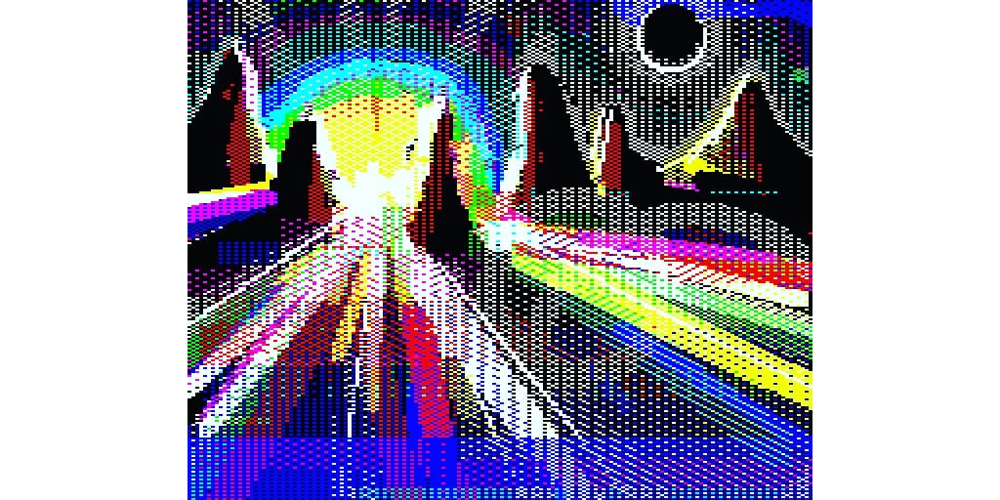

## AwfuLite - Ray of lite...



- It's actually my main text editor... live patching in public...

- It's actually not anymore true... I use vscode... But this may change for some reason.


- 2 way to demo something... you fuel the engine or you engineers the fuel.

HackIT is me, also [Awaxx] and 752963e64. I'm not schizo :)

### How to install

- depends on SDL2 library, xsel & hexdump command line tools.

```bash
git clone https://github.com/752963e64/AwfuLite
cd AwfuLite
./build.sh
./lite
```

### How to handle the beast

- first time you'll use it.
```sh
[[ -d ~/bin ]] || mkdir ~/bin
ln -sv $PATH_TO_LITE_DIR/lite ~/bin/awfulite
export PATH=~/bin:$PATH # if it's not already assumed... check it, first...
```

- Go to directory you are about to work on, Now startup the beast.

```sh
awfulite &
```

- Another way is to take in consideration that you gonna seriously mess it up...

following this way, let you test your additions first.
```sh
cd ~
git clone https://github.com/752963e64/AwfuLite
[[ -d ~/bin ]] || mkdir ~/bin
cp -rf AwfuLite work_on
ln -sv ~/AwfuLite/lite ~/bin/awfulite
export PATH=~/bin:$PATH # if it's not already assumed... check it, first...

function apply_shit()
{
  [[ -x ./lite ]] && { cp -rvf $(pwd)/* ~/AwfuLite; return 0; }
}

cd work_on
awfulite &
# you keep testing additions by launching ./lite aside...
# you throw apply_shit when you feel okay with your mess...
apply_shit
# Now you should apply/commit changes to ~/AwfuLite
awfulite & # back to camp fire 
# simple...
```

- type **ctrl+shift+t**, Now you are on your own rdy to impress or deceive...

#### the console behavior is non-interactive, throw a cmd and get feedback... nah enouf? use your terminal...
- **ctrl+:** => open a console view...
- **ctrl+shift+:** => throw a command to your bash shell...

#### to keep track from runtime errors and information.
- **ctrl+!** => open up **the** log view

#### filemanager, a context menu is planned...
- **ctrl+shift+t** => open up a semi interactive file browser on the window's left side walking CWD...

#### walk through cmd by typing... it doesn't list entirely...
- **ctrl+shift+p** => open up internal command handler...
- **escape** => close the command handler if opened...
- **up|down** => select command into the list if opened...
- **return** => throw the choosen command if opened...
- **tab** => autocomplete commands if opened...

#### file related... should be common to writerz.
- **ctrl+o** => open up an existing file...
- **ctrl+n** => open up a new file...
- **ctrl+s** => save up the current files with modifs...
- **ctrl+shift+s** => save up current file to the desired filename
- **ctrl+z** => undo
- **ctrl+shift+z** => redo
- **ctrl+w** => to close the current file...

#### related to selection into a document...
- **ctrl+a** => select all from the current file.
- **ctrl+x** => cut selection
- **ctrl+c** => copy selection
- **ctrl+l** => select entire line
- **ctrl+d** => select word
- **ctrl+v** => paste selection to the current text cursor position
- **ctrl+up|down** => hold entire line from current text cursor position and swap to the given direction

#### split document workspace into multiple workspaces

see workspace screenshot for an overview...

- **alt+shift+l** => split to the right 
- **alt+shift+k** => split to down
- **alt+shift+j** => split to left
- **alt+shift+i** => split to up

- **alt+j** => switch to left workspace
- **alt+l** => switch right workspace
- **alt+i** => switch up workspace
- **alt+k** => switch down workspace


#### syntax based binding
- **ctrl+*** => comment up a line using syntax's pattern.

- **ctrl+q** => quit the software...


### Stuff DONE

```
- linux clipboards - handled by xsel avoiding savagery over SDL2.
- added more font icons
- moved syntaxes and colors to their own dir...
- removed plugins and now loading them using a list.
- reloading modules works out of the box without overlaping...
- swapped some keybinding to more common one... (at least for me...)
- added accurate scrolling methods to every view needing a scroll method.
- added correct focus to let current doc keep focus as well.
- removed tabs to use that space for the documents which is better, to me.
- numerical file handler into statusview, mouse handling to be added still...
- add back ubuntu® fonts and struct access for futur usage...
- more fix around workspaces, can't open copy from opened files (through nodes :)) and grab focus from original instead.
- ( ctrl+a, ctrl+c, alt+shift+j, ctrl+n, ctrl+v ) is the way to open a copy from the current document...
- autoscroll (up'n down)
- mouse scroll feedback into statusview
- added show_block_rulers to docview.
- added space and tab rendering.
- improved tokenizer to catch more token
- added markers to docview. original implementation by Petri Häkkinen
- added dynamic current working directory, changeable from commands
- improved selection engine to handle multiselection modes
- ( ctrl + left mouse button => permits to place cursors anywhere you wish )
- ( shift + right mouse button => permits to select vertically up'n down right'to left )
- added correct column tracking over unicode
- fixed focus through nodes...
- git driver driven by commands/shortcuts - ./data/core/commands/git.lua
     
     # statusview scheme
     (document changes appears orange) dirty | openfiles/index | filename | line/col percent    icon | total lines | line ending | (mixed tab/space document ~= config appears orange) tabtype tabsize
```

### Some TODO

```
- node divider handling over some plugins (treeview)
- horizontal scroll method
- code folding
- mouse feedback in statusview doesn't handle multiple workspace
- statusview shouldn't show home path instead use a tild ~.
- add a debug mode to docview... surface usually split verticaly to print step information
- implement a timeline player.
- overlaping box which act as menu pop...
- add an acceleration method for autoscroll
- add pattern text matching methods to multi selection
- fix undo/redo with multi selection
- <s>independent documents</s> now needs to track on disk file changes?...
- user styles loads after logging...
- a markdown viewer... (needs stateful engines)
- highlight gutter instead line
- abrupt selections kills the feel someone human did it... gotta test smooth methods :Ð
- phased rendering, orchestration and composition
- windowed plugins using lite renderer
- add an internal font viewver, with this pangram "You may fuck yourself deeply, if you attempt suing me." :D
- dynamic font scaling to get rid of static storage...
- stateful engines (obj) around components (audio, network, media, data)
- binary report tools
- store session
- rounded rectangle
- more plugins
```

### HACK lite/.lite_project.lua

- project session for rapid devel...

```lua
local core = require "core"

core.root_view:open_doc(core.open_doc("/home/<user>/lite/LICENSE"))
core.root_view:open_doc(core.open_doc("/home/<user>/lite/README.md"))
core.root_view:open_doc(core.open_doc("/home/<user>/lite/data/<file>"))

print("hello world o/")
```

## License

**[lite](https://github.com/rxi/lite)** is MIT licensed.

**[AwfuLite](https://github.com/752963e64/AwfuLite)** is MIT licensed.

See [LICENSE](LICENSE) for details.

###### by HackIT.


